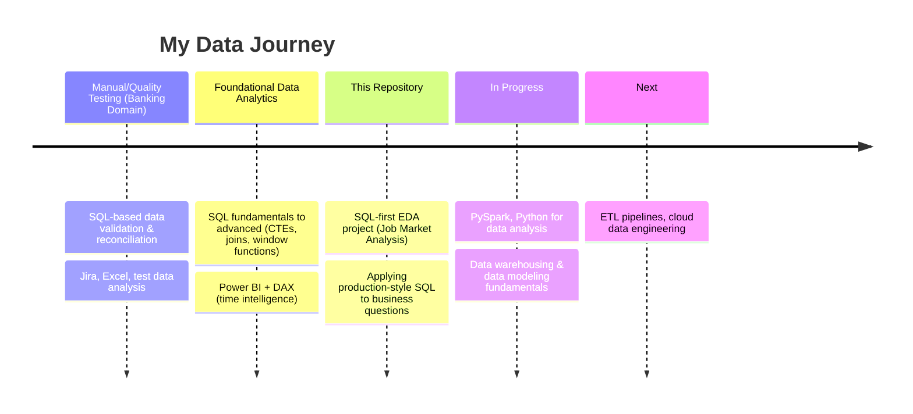

<div align="center">

# 🗄️ SQL Data Engineering Projects

### Turning Raw Data Into Real-World Business Insights — One Query at a Time

[](https://www.postgresql.org/)
[](#)
[](#)
[](LICENSE)
[](#)

**📍 Navi Mumbai, India&nbsp; | &nbsp;💼 Digital Quality Engineer → Analyst / Data Engineer&nbsp; | &nbsp;🚀 SQL • Power BI • Python**

[🔗 GitHub Profile](https://github.com/Manichandu2210) • [💼 LinkedIn](https://www.linkedin.com/in/b-manichandu-729836337) • [📧 Email](mailto:manichandub2210@gmail.com)

</div>

---

## 📖 Repository Overview

This repository is a **structured, portfolio-grade collection of SQL and data engineering projects**, built to demonstrate real-world, business-relevant data problem-solving — not classroom exercises.

Every project here follows a consistent standard:

- ✅ Realistic business questions, not toy datasets
- ✅ Clean, commented, production-style SQL
- ✅ Documented thought process from problem → query → insight
- ✅ Reproducible: schema, queries, and findings all included
- ✅ Written for a reviewer to understand *why*, not just *what*

> **Why this repo exists:** I come from a Quality Engineering background in banking (NACH/fintech domain) where SQL-based data validation and reconciliation are daily work. This repository is where I formalize that SQL foundation into analytical and data engineering skill. My focus isn't locked to one job title — it's the underlying capability: SQL, data modeling, pipelines, and analysis. That skill set maps to Data Analyst, Business Analyst, Product Analyst, and Quantitative Analyst roles, as well as Data Engineer roles, and I'm targeting whichever of these best matches the skills demonstrated here.

---

## 🗺️ Project Roadmap

<table>
<tr>
<th align="center">Status</th>
<th>Project</th>
<th>Focus Area</th>
<th>Core Skills</th>
</tr>
<tr>
<td align="center">✅</td>
<td><b>EDA — Job Market Skills Analysis</b></td>
<td>Exploratory Data Analysis</td>
<td>CTEs, Joins, Aggregations, Subqueries</td>
</tr>
<tr>
<td align="center">🔜</td>
<td>Data Warehouse Project</td>
<td>Dimensional Modeling</td>
<td>Star Schema, Fact/Dim Tables, SCDs</td>
</tr>
<tr>
<td align="center">🔜</td>
<td>ETL Pipeline Project</td>
<td>Data Engineering</td>
<td>Extract-Transform-Load, Automation, Scheduling</td>
</tr>
<tr>
<td align="center">🔜</td>
<td>Data Modeling Project</td>
<td>Database Design</td>
<td>Normalization, ERDs, Schema Design</td>
</tr>
<tr>
<td align="center">🔜</td>
<td>Python Data Analysis Project</td>
<td>Analytics Engineering</td>
<td>Pandas, NumPy, Visualization</td>
</tr>
<tr>
<td align="center">🔜</td>
<td>Cloud Data Engineering Project</td>
<td>Cloud Data Platforms</td>
<td>Cloud Warehousing, Pipelines, Orchestration</td>
</tr>
</table>

**Legend:** ✅ Completed &nbsp;|&nbsp; 🔧 In Progress &nbsp;|&nbsp; 🔜 Planned

---

## 🚀 Featured Project: Job Market Skills Analysis (EDA)

<div align="center">
<i>Analyzing real-world job posting data to answer: "What SQL skills should a data professional actually learn to maximize salary and employability?"</i>
</div>

### 🎯 Business Problem

Job seekers and career-switchers face a common question — *which skills are worth the time investment?* This project uses SQL alone (no external BI tools) to mine job posting data and answer that question with evidence, not guesswork.

### 🔍 Key Analyses Performed

| # | Analysis | SQL Techniques Used |
|---|----------|----------------------|
| 1 | Identified **top in-demand skills** across job postings | `GROUP BY`, `COUNT()`, `ORDER BY` |
| 2 | Identified **top-paying skills** by average salary | Aggregate functions, `AVG()`, filtering |
| 3 | Cross-referenced **demand vs. salary** to find optimal skills | `JOIN`, `CTE`, nested subqueries |
| 4 | Ranked and ranked-filtered results for decision-making | Window functions, `RANK()` |
| 5 | Structured multi-step logic for readability & reuse | CTEs (`WITH` clauses), modular queries |

<details>
<summary><b>📂 Click to view project structure</b></summary>

```
📁 01_EDA_Job_Market_Analysis/
│
├── 📁 sql/
│   ├── 01_top_demanded_skills.sql
│   ├── 02_top_paying_skills.sql
│   ├── 03_optimal_skills.sql
│   └── 04_ctes_and_joins.sql
│
├── 📁 data/
│   └── schema_reference.md
│
├── 📁 outputs/
│   └── results_summary.md
│
└── README.md
```

</details>

<details>
<summary><b>💡 Sample Insight Format</b></summary>

```
Skill: SQL
Demand Rank: #1
Avg. Salary Impact: High
Optimal Skill: ✅ Yes (High Demand + High Pay)
```

Full breakdowns and query outputs are documented inside each project folder.

</details>

### 📌 Business Impact

This project simulates a real analytics ask: *"Tell me where to focus, backed by data."* It reflects the kind of query-driven decision support Data Analysts are expected to deliver to stakeholders.

---

## 🧰 Technology Stack

<div align="center">


</div>

| Category | Tools |
|---|---|
| **Querying & Databases** | PostgreSQL, MySQL, SQL Server |
| **Data Visualization** | Power BI, DAX (time intelligence, CALCULATE, iterators) |
| **Programming** | Python (Pandas, NumPy — in progress) |
| **Version Control** | Git, GitHub |
| **Planned / Learning** | PySpark, Cloud Data Warehousing, ETL Orchestration |

---

## 🧠 Skills Demonstrated

- 🔹 **Advanced SQL Querying** — multi-table joins, correlated & nested subqueries, CTEs
- 🔹 **Aggregation & Grouping Logic** — `GROUP BY`, `HAVING`, aggregate functions at scale
- 🔹 **Window Functions** — ranking, partitioning, running comparisons
- 🔹 **Query Optimization Thinking** — structuring readable, maintainable, reusable SQL
- 🔹 **Business Translation** — converting a vague business question into a precise query plan
- 🔹 **Data Storytelling** — presenting SQL output as a decision-ready insight, not a raw table
- 🔹 **Documentation Discipline** — every project is explained clearly enough for a non-author to follow

---

## 📈 Learning Journey



I come from a **manual/quality testing background in the banking domain (NACH ecosystem)**, where SQL was already a daily tool for reconciliation and validation. This repository documents my transition from *using SQL to catch defects* to *using SQL to generate insight* — and eventually, to *building the pipelines that deliver that data in the first place.*

---

## 🔮 Future Planned Projects

| Project | What It Will Demonstrate |
|---|---|
| 🏗️ **Data Warehouse Project** | Star schema design, fact/dimension modeling, slowly changing dimensions |
| ⚙️ **ETL Pipeline Project** | End-to-end extract-transform-load workflow with automation and validation |
| 🧩 **Data Modeling Project** | Normalized relational schema design, ER diagrams, referential integrity |
| 🐍 **Python Data Analysis Project** | Pandas/NumPy-driven analysis, visualization, and reporting |
| ☁️ **Cloud Data Engineering Project** | Cloud-hosted warehousing, pipeline orchestration, and scalable storage |

Each project will be added as its own top-level folder, following the same documentation standard as the featured project above.

---

## 📁 Full Repository Structure

```
SQL_Data_Engineering_Projects/
│
├── 📁 01_EDA_Job_Market_Analysis/     ✅ Completed
├── 📁 02_Data_Warehouse_Project/      🔜 Planned
├── 📁 03_ETL_Pipeline_Project/        🔜 Planned
├── 📁 04_Data_Modeling_Project/       🔜 Planned
├── 📁 05_Python_Data_Analysis/        🔜 Planned
├── 📁 06_Cloud_Data_Engineering/      🔜 Planned
│
├── 📄 README.md
└── 📄 LICENSE
```

---

## 👤 About Me

I'm **Manichandu**, currently working as a **Digital Quality Engineer** in the banking/fintech domain (NACH ecosystem), and actively transitioning out of manual testing into a **data-driven career** — Data Analyst, Business Analyst, Product Analyst, Quantitative Analyst, or Data Engineer. I'm not chasing a single job title; I'm building a skill set — SQL, data modeling, pipelines, BI, and analysis — that maps cleanly onto all of them, and I'm targeting the role where that skill set creates the most value.

My background gives me something a lot of career-switchers don't have: **real production experience with SQL-based data validation, reconciliation, and reporting** in a regulated banking environment. I'm now building on that foundation with structured SQL, Power BI/DAX, and Python skills — and this repository is where that growth is documented, project by project.

- 🔭 Currently building: SQL & data engineering portfolio projects
- 🌱 Currently learning: PySpark, Python for data analysis, cloud data warehousing
- 🎯 Open to: Data Analyst, Business Analyst, Product Analyst, Quantitative Analyst, and Data Engineer roles
- 💬 Ask me about: SQL, banking/fintech data workflows, Power BI DAX, QA-to-analytics transition
- ⚡ Fun fact: I got here through quality testing — I learned to trust data by first learning to break it

---

## 🤝 Let's Connect

<div align="center">

[](https://github.com/Manichandu2210)
[](https://www.linkedin.com/in/b-manichandu-729836337)
[](mailto:manichandub2210@gmail.com)

**⭐ If this repository is useful or interesting to you, consider giving it a star — it helps a lot!**

</div>

---

<div align="center">
<sub>Built with 📊 SQL, ☕ persistence, and a genuine curiosity for how data drives decisions.</sub>
</div>
